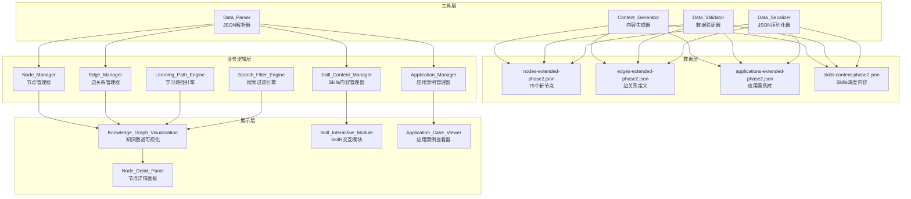

# 设计文档 - Phase 2 内容深度扩展

## 概述

Phase 2内容深度扩展项目旨在将知识图谱系统从75个节点扩展到150个节点，新增75个高级数学概念节点，深化Skills模块内容，并完善100个行业应用案例。本设计文档详细说明了系统架构、核心组件、数据模型和实现策略。

### 项目目标

1. 新增75个高级数学知识节点，覆盖曲率、场论、偏微分方程、变分法、随机过程等高级主题
2. 为每个domain创建指定数量的新节点（domain-1: 20个，domain-2: 24个，domain-3: 18个，domain-4: 10个，domain-5: 3个）
3. 深化Skills模块内容，为每个Skill添加高级主题、进阶练习题和项目实战
4. 完善应用案例库至100个案例，覆盖15个以上行业领域
5. 建立完整的节点关系网络，包括前置关系、跨域关系和应用关系
6. 提供内容生成器和数据验证器工具，确保数据质量和一致性

### 技术栈

- 前端框架: D3.js (知识图谱可视化), Three.js (3D可视化), Plotly (数据图表)
- 数据格式: JSON
- 数学公式渲染: LaTeX/MathJax
- 编程语言: JavaScript (前端), Python (数据生成和验证脚本)
- 测试框架: Jest (单元测试), fast-check (属性测试)

### 与Phase 1的集成

Phase 2将在Phase 1的基础上扩展，保持数据格式和系统架构的一致性：

- 复用Phase 1的节点和边数据结构
- 扩展现有的domain分类体系
- 继承Skills系统的架构设计
- 保持与现有可视化系统的兼容性

## 架构

### 系统架构图



### 架构设计原则

1. **模块化设计**: 每个组件职责单一，便于测试和维护
2. **数据驱动**: 所有内容通过JSON配置，支持动态加载和更新
3. **渐进式加载**: 支持按需加载节点详情和应用案例，优化性能
4. **可扩展性**: 预留接口支持未来Phase 3的扩展
5. **向后兼容**: 保持与Phase 1数据格式的完全兼容

## 组件和接口

### 1. Content_Generator (内容生成器)

内容生成器是Phase 2的核心工具，负责批量创建节点、边关系、应用案例和Skills内容。

#### 职责

- 根据配置生成指定数量的节点
- 为每个节点生成完整的元数据（名称、描述、公式、前置知识等）
- 生成节点之间的边关系（前置、跨域、应用）
- 生成应用案例并关联到相关节点
- 生成Skills的深度内容（高级主题、练习题、项目）

#### 接口设计

```javascript
class ContentGenerator {
  /**
   * 生成指定domain的节点
   * @param {string} domainId - Domain ID (e.g., "domain-1")
   * @param {number} count - 要生成的节点数量
   * @param {Object} config - 生成配置
   * @returns {Array<Node>} 生成的节点数组
   */
  generateNodes(domainId, count, config) {}
  
  /**
   * 生成节点之间的边关系
   * @param {Array<Node>} nodes - 节点数组
   * @param {Object} config - 边生成配置
   * @returns {Array<Edge>} 生成的边数组
   */
  generateEdges(nodes, config) {}
  
  /**
   * 生成应用案例
   * @param {number} count - 要生成的案例数量
   * @param {Array<string>} industries - 行业列表
   * @param {Array<Node>} nodes - 相关节点
   * @returns {Array<Application>} 生成的应用案例数组
   */
  generateApplications(count, industries, nodes) {}
  
  /**
   * 生成Skills深度内容
   * @param {string} skillId - Skill ID
   * @param {Object} content - 内容配置
   * @returns {Object} Skills内容对象
   */
  generateSkillContent(skillId, content) {}
  
  /**
   * 导出所有生成的数据到JSON文件
   * @param {string} outputDir - 输出目录
   */
  exportToJSON(outputDir) {}
}
```

#### 配置格式

```javascript
const generatorConfig = {
  domains: {
    "domain-1": {
      count: 20,
      difficulty: [3, 4, 5],
      topics: ["曲率", "函数作图", "不等式证明", "泰勒展开应用"],
      estimatedStudyTime: [45, 60, 90]
    },
    "domain-2": {
      count: 24,
      difficulty: [3, 4, 5],
      topics: ["曲线积分", "曲面积分", "场论", "偏微分方程", "级数应用"],
      estimatedStudyTime: [60, 90, 120]
    }
    // ... 其他domains
  },
  edges: {
    prerequisiteRatio: 0.7,  // 70%的节点有前置关系
    crossDomainRatio: 0.2,   // 20%的节点有跨域关系
    applicationRatio: 0.5    // 50%的节点有应用关系
  },
  applications: {
    totalCount: 100,
    industries: [
      "人工智能与机器学习", "金融科技", "医疗健康",
      "通信工程", "机械工程", "环境科学"
      // ... 更多行业
    ],
    minCodeLength: 50,  // 最小代码行数
    requireVisualization: true
  }
};
```

### 2. Data_Validator (数据验证器)

数据验证器确保所有生成的数据符合格式要求和业务规则。

#### 职责

- 验证JSON格式正确性
- 验证必需字段完整性
- 验证数据类型和取值范围
- 验证引用完整性（节点ID、Skill ID等）
- 检测循环依赖
- 验证LaTeX公式语法
- 生成详细的验证报告

#### 接口设计

```javascript
class DataValidator {
  /**
   * 验证节点数据
   * @param {Array<Node>} nodes - 节点数组
   * @returns {ValidationResult} 验证结果
   */
  validateNodes(nodes) {}
  
  /**
   * 验证边数据
   * @param {Array<Edge>} edges - 边数组
   * @param {Array<Node>} nodes - 节点数组（用于引用检查）
   * @returns {ValidationResult} 验证结果
   */
  validateEdges(edges, nodes) {}
  
  /**
   * 验证应用案例数据
   * @param {Array<Application>} applications - 应用案例数组
   * @param {Array<Node>} nodes - 节点数组
   * @returns {ValidationResult} 验证结果
   */
  validateApplications(applications, nodes) {}
  
  /**
   * 检测循环依赖
   * @param {Array<Edge>} edges - 边数组
   * @returns {Array<Array<string>>} 循环路径数组
   */
  detectCycles(edges) {}
  
  /**
   * 验证LaTeX公式
   * @param {string} formula - LaTeX公式字符串
   * @returns {boolean} 是否有效
   */
  validateLatex(formula) {}
  
  /**
   * 生成验证报告
   * @param {Array<ValidationResult>} results - 验证结果数组
   * @returns {string} HTML格式的报告
   */
  generateReport(results) {}
}
```

#### 验证规则

```javascript
const validationRules = {
  node: {
    requiredFields: [
      "id", "name", "nameEn", "description", 
      "domains", "difficulty", "prerequisites",
      "relatedSkills", "keywords", "estimatedStudyTime"
    ],
    difficulty: { min: 1, max: 5 },
    estimatedStudyTime: { min: 30, max: 120 },
    idPattern: /^node-[a-z0-9-]+$/,
    minKeywords: 3,
    minApplications: 1
  },
  edge: {
    requiredFields: ["id", "source", "target", "type", "strength"],
    types: ["prerequisite", "cross-domain", "application"],
    strength: { min: 0, max: 1 }
  },
  application: {
    requiredFields: [
      "id", "title", "industry", "difficulty",
      "relatedNodes", "description", "mathematicalConcepts",
      "problemStatement", "solution", "code", "visualization"
    ],
    minCodeLength: 50,
    supportedLanguages: ["python", "javascript"]
  }
};
```

### 3. Node_Manager (节点管理器)

节点管理器负责节点的加载、查询和管理。

#### 接口设计

```javascript
class NodeManager {
  /**
   * 加载所有节点数据
   * @param {Array<string>} filePaths - JSON文件路径数组
   * @returns {Promise<Array<Node>>} 节点数组
   */
  async loadNodes(filePaths) {}
  
  /**
   * 根据ID获取节点
   * @param {string} nodeId - 节点ID
   * @returns {Node|null} 节点对象
   */
  getNodeById(nodeId) {}
  
  /**
   * 根据domain过滤节点
   * @param {string} domainId - Domain ID
   * @returns {Array<Node>} 节点数组
   */
  getNodesByDomain(domainId) {}
  
  /**
   * 根据难度范围过滤节点
   * @param {number} minDifficulty - 最小难度
   * @param {number} maxDifficulty - 最大难度
   * @returns {Array<Node>} 节点数组
   */
  getNodesByDifficulty(minDifficulty, maxDifficulty) {}
  
  /**
   * 搜索节点
   * @param {string} keyword - 关键词
   * @returns {Array<Node>} 匹配的节点数组
   */
  searchNodes(keyword) {}
  
  /**
   * 获取节点的前置节点
   * @param {string} nodeId - 节点ID
   * @returns {Array<Node>} 前置节点数组
   */
  getPrerequisites(nodeId) {}
  
  /**
   * 获取节点的后续节点
   * @param {string} nodeId - 节点ID
   * @returns {Array<Node>} 后续节点数组
   */
  getSuccessors(nodeId) {}
}
```

### 4. Learning_Path_Engine (学习路径引擎)

学习路径引擎根据用户的学习进度推荐合适的学习路径。

#### 接口设计

```javascript
class LearningPathEngine {
  /**
   * 分析用户当前水平
   * @param {Array<string>} completedNodeIds - 已完成的节点ID数组
   * @returns {Object} 用户水平分析结果
   */
  analyzeUserLevel(completedNodeIds) {}
  
  /**
   * 推荐下一步可学习的节点
   * @param {Array<string>} completedNodeIds - 已完成的节点ID数组
   * @param {number} count - 推荐数量
   * @returns {Array<Node>} 推荐节点数组
   */
  recommendNextNodes(completedNodeIds, count) {}
  
  /**
   * 计算从起点到目标节点的学习路径
   * @param {string} startNodeId - 起点节点ID
   * @param {string} targetNodeId - 目标节点ID
   * @returns {Array<Node>} 学习路径节点数组
   */
  calculatePath(startNodeId, targetNodeId) {}
  
  /**
   * 估算学习路径所需时间
   * @param {Array<Node>} path - 学习路径
   * @returns {number} 估算时间（分钟）
   */
  estimatePathTime(path) {}
}
```

### 5. Search_Filter_Engine (搜索过滤引擎)

搜索过滤引擎提供强大的搜索和过滤功能。

#### 接口设计

```javascript
class SearchFilterEngine {
  /**
   * 应用多个过滤条件
   * @param {Object} filters - 过滤条件对象
   * @returns {Array<Node>} 过滤后的节点数组
   */
  applyFilters(filters) {}
  
  /**
   * 全文搜索
   * @param {string} query - 搜索查询
   * @returns {Array<Node>} 搜索结果
   */
  fullTextSearch(query) {}
  
  /**
   * 按行业过滤应用案例
   * @param {string} industry - 行业名称
   * @returns {Array<Application>} 应用案例数组
   */
  filterApplicationsByIndustry(industry) {}
  
  /**
   * 获取过滤统计信息
   * @param {Object} filters - 过滤条件
   * @returns {Object} 统计信息
   */
  getFilterStats(filters) {}
}
```

## 数据模型

### Node (节点)

```javascript
{
  "id": "node-curvature",
  "name": "曲率",
  "nameEn": "Curvature",
  "description": "曲率描述曲线在某点的弯曲程度，是微分几何的基本概念。平面曲线的曲率定义为切线转角对弧长的导数，反映了曲线偏离直线的程度。",
  "domains": ["domain-1"],
  "traditionalChapter": "chapter-3",
  "difficulty": 4,
  "prerequisites": ["node-derivative-def", "node-parametric-equations"],
  "relatedSkills": ["导数与微分Skill", "几何应用Skill"],
  "formula": "\\kappa = \\frac{|y''|}{(1 + y'^2)^{3/2}} = \\frac{|\\mathbf{r}'(t) \\times \\mathbf{r}''(t)|}{|\\mathbf{r}'(t)|^3}",
  "keywords": ["曲率", "曲率半径", "曲率中心", "密切圆"],
  "importance": 4,
  "estimatedStudyTime": 60,
  "realWorldApplications": [
    {
      "title": "道路设计中的曲率控制",
      "description": "在高速公路和铁路设计中，曲率决定了车辆的安全速度和乘客舒适度",
      "industry": "土木工程"
    },
    {
      "title": "计算机图形学中的曲线平滑",
      "description": "使用曲率连续性（G2连续）确保曲线的视觉平滑性",
      "industry": "计算机图形学"
    }
  ],
  "advancedTopics": [
    "曲率张量",
    "高斯曲率",
    "平均曲率",
    "测地曲率"
  ],
  "visualizationConfig": {
    "type": "interactive-curve",
    "showCurvatureCircle": true,
    "showTangent": true,
    "showNormal": true
  }
}
```

### Edge (边关系)

```javascript
{
  "id": "edge-phase2-001",
  "source": "node-derivative-def",
  "target": "node-curvature",
  "type": "prerequisite",
  "strength": 0.9,
  "description": "曲率的计算需要导数知识",
  "metadata": {
    "phase": "phase2",
    "createdDate": "2026-02-23"
  }
}
```

边类型说明：
- `prerequisite`: 前置关系，表示学习target前需要先学习source
- `cross-domain`: 跨域关系，连接不同domain的相关概念
- `application`: 应用关系，连接理论节点和应用案例

### Application (应用案例)

```javascript
{
  "id": "app-neural-network-backprop",
  "title": "神经网络反向传播算法",
  "industry": "人工智能与机器学习",
  "difficulty": 4,
  "relatedNodes": ["node-derivative-def", "node-chain-rule", "node-gradient"],
  "relatedDomains": ["domain-1", "domain-3"],
  "description": "反向传播是训练神经网络的核心算法，通过链式法则计算损失函数对每个参数的梯度，然后使用梯度下降更新参数。",
  "mathematicalConcepts": [
    "复合函数求导",
    "链式法则",
    "梯度",
    "梯度下降"
  ],
  "problemStatement": "给定神经网络损失函数 L(W,b)，如何高效计算所有参数的梯度？",
  "mathematicalModel": {
    "lossFunction": "L = \\frac{1}{2}\\sum_{i=1}^n (y_i - \\hat{y}_i)^2",
    "forwardPass": "a^{(l)} = \\sigma(W^{(l)}a^{(l-1)} + b^{(l)})",
    "backwardPass": "\\delta^{(l)} = (W^{(l+1)})^T \\delta^{(l+1)} \\odot \\sigma'(z^{(l)})",
    "gradients": "\\frac{\\partial L}{\\partial W^{(l)}} = \\delta^{(l)} (a^{(l-1)})^T"
  },
  "solution": {
    "steps": [
      "前向传播：计算每层的激活值",
      "计算输出层误差：δ^(L) = (a^(L) - y) ⊙ σ'(z^(L))",
      "反向传播误差：从输出层向输入层传播δ",
      "计算梯度：∂L/∂W^(l) = δ^(l) (a^(l-1))^T",
      "更新参数：W := W - η∂L/∂W"
    ],
    "complexity": "O(n × m × L)，其中n是样本数，m是每层神经元数，L是层数"
  },
  "code": {
    "language": "python",
    "implementation": "import numpy as np\n\nclass NeuralNetwork:\n    def __init__(self, layers):\n        self.weights = [np.random.randn(y, x) for x, y in zip(layers[:-1], layers[1:])]\n        self.biases = [np.random.randn(y, 1) for y in layers[1:]]\n    \n    def sigmoid(self, z):\n        return 1.0 / (1.0 + np.exp(-z))\n    \n    def sigmoid_prime(self, z):\n        return self.sigmoid(z) * (1 - self.sigmoid(z))\n    \n    def forward(self, x):\n        activations = [x]\n        zs = []\n        for w, b in zip(self.weights, self.biases):\n            z = np.dot(w, activations[-1]) + b\n            zs.append(z)\n            activations.append(self.sigmoid(z))\n        return activations, zs\n    \n    def backward(self, x, y):\n        activations, zs = self.forward(x)\n        \n        # 输出层误差\n        delta = (activations[-1] - y) * self.sigmoid_prime(zs[-1])\n        \n        # 梯度\n        nabla_w = [np.zeros(w.shape) for w in self.weights]\n        nabla_b = [np.zeros(b.shape) for b in self.biases]\n        \n        nabla_w[-1] = np.dot(delta, activations[-2].T)\n        nabla_b[-1] = delta\n        \n        # 反向传播\n        for l in range(2, len(self.weights) + 1):\n            delta = np.dot(self.weights[-l+1].T, delta) * self.sigmoid_prime(zs[-l])\n            nabla_w[-l] = np.dot(delta, activations[-l-1].T)\n            nabla_b[-l] = delta\n        \n        return nabla_w, nabla_b\n    \n    def update(self, nabla_w, nabla_b, learning_rate):\n        self.weights = [w - learning_rate * nw for w, nw in zip(self.weights, nabla_w)]\n        self.biases = [b - learning_rate * nb for b, b in zip(self.biases, nabla_b)]"
  },
  "visualization": {
    "type": "interactive-network",
    "description": "可视化神经网络的前向传播和反向传播过程，显示每层的激活值和梯度",
    "library": "plotly",
    "features": ["动画演示", "参数调节", "损失曲线"]
  },
  "realWorldImpact": "反向传播算法是深度学习革命的基础，使得训练大规模神经网络成为可能，广泛应用于图像识别、自然语言处理、语音识别等领域。",
  "references": [
    "Rumelhart, D. E., Hinton, G. E., & Williams, R. J. (1986). Learning representations by back-propagating errors.",
    "Goodfellow, I., Bengio, Y., & Courville, A. (2016). Deep Learning. MIT Press."
  ],
  "estimatedStudyTime": 90
}
```

### SkillContent (Skills内容)

```javascript
{
  "skillId": "函数极限与连续Skill",
  "phase": "phase2",
  "advancedTopics": [
    {
      "id": "topic-uniform-continuity",
      "title": "一致连续性",
      "description": "一致连续性是比连续性更强的性质，要求δ的选择不依赖于具体的点x",
      "formula": "\\forall \\varepsilon > 0, \\exists \\delta > 0, \\forall x_1, x_2 \\in D: |x_1 - x_2| < \\delta \\Rightarrow |f(x_1) - f(x_2)| < \\varepsilon",
      "examples": [
        "f(x) = x^2 在有界区间上一致连续",
        "f(x) = 1/x 在(0,1)上不一致连续"
      ],
      "applications": ["数值分析", "函数逼近理论"]
    },
    {
      "id": "topic-lipschitz-condition",
      "title": "利普希茨条件",
      "description": "利普希茨条件是一致连续性的充分条件，要求函数的变化率有界",
      "formula": "|f(x_1) - f(x_2)| \\leq L|x_1 - x_2|, \\quad \\forall x_1, x_2 \\in D",
      "examples": [
        "f(x) = sin(x) 满足利普希茨条件，L=1",
        "f(x) = √x 在[0,1]上不满足利普希茨条件"
      ],
      "applications": ["微分方程解的存在唯一性", "优化算法收敛性分析"]
    }
  ],
  "advancedExercises": [
    {
      "id": "exercise-adv-001",
      "difficulty": 4,
      "question": "证明：若f在闭区间[a,b]上连续，则f在[a,b]上一致连续。",
      "hints": [
        "使用反证法和有限覆盖定理",
        "考虑ε-δ定义中δ的选择"
      ],
      "solution": {
        "steps": [
          "假设f不一致连续，则存在ε₀>0，对任意δ>0，存在x₁,x₂使得|x₁-x₂|<δ但|f(x₁)-f(x₂)|≥ε₀",
          "取δₙ=1/n，得到序列{xₙ},{yₙ}满足|xₙ-yₙ|<1/n但|f(xₙ)-f(yₙ)|≥ε₀",
          "由Bolzano-Weierstrass定理，{xₙ}有收敛子列xₙₖ→x₀∈[a,b]",
          "由|xₙₖ-yₙₖ|<1/nₖ→0，得yₙₖ→x₀",
          "由f连续，f(xₙₖ)→f(x₀)且f(yₙₖ)→f(x₀)，故|f(xₙₖ)-f(yₙₖ)|→0",
          "这与|f(xₙₖ)-f(yₙₖ)|≥ε₀矛盾"
        ],
        "keyPoints": ["有限覆盖定理", "序列收敛", "连续性定义"]
      },
      "relatedNodes": ["node-continuity", "node-limit-def"],
      "estimatedTime": 30
    }
  ],
  "projects": [
    {
      "id": "project-001",
      "title": "数值计算中的函数逼近",
      "description": "实现多种函数逼近方法，比较它们的精度和效率",
      "difficulty": 4,
      "objectives": [
        "理解函数逼近的数学原理",
        "实现泰勒展开、插值和最小二乘逼近",
        "分析不同方法的误差和适用范围"
      ],
      "tasks": [
        {
          "step": 1,
          "description": "实现泰勒级数逼近",
          "code": "def taylor_approximation(f, x0, n, x):\n    # 计算f在x0处的n阶泰勒展开在x处的值\n    pass"
        },
        {
          "step": 2,
          "description": "实现拉格朗日插值",
          "code": "def lagrange_interpolation(points, x):\n    # 给定点集，计算拉格朗日插值多项式在x处的值\n    pass"
        },
        {
          "step": 3,
          "description": "比较不同方法逼近sin(x)的效果",
          "visualization": "绘制原函数和各种逼近函数的图像，显示误差分布"
        }
      ],
      "deliverables": [
        "完整的Python实现",
        "误差分析报告",
        "可视化对比图表"
      ],
      "estimatedTime": 180
    }
  ]
}
```

## 数据文件结构

Phase 2将创建以下数据文件：

### 文件组织

```
data/
├── nodes-extended-phase2.json          # 75个新节点
├── edges-extended-phase2.json          # 新的边关系
├── applications-extended-phase2.json   # 应用案例库
├── skills-content-phase2.json          # Skills深度内容
└── metadata-phase2.json                # Phase 2元数据
```

### 文件格式规范

每个数据文件都包含metadata部分和数据部分：

```javascript
{
  "metadata": {
    "version": "2.0",
    "phase": "Phase 2 - 内容深度扩展",
    "totalItems": 75,
    "createdDate": "2026-02-23",
    "description": "Phase 2新增的75个高级节点",
    "author": "Content_Generator",
    "dependencies": ["nodes-extended-phase1.json"]
  },
  "data": [
    // 实际数据项
  ]
}
```

### 数据加载策略

系统支持多种数据加载模式：

1. **完整加载模式**: 一次性加载所有Phase 1和Phase 2数据
2. **渐进加载模式**: 先加载基础数据，按需加载详细内容
3. **按需加载模式**: 仅加载用户当前查看的节点和相关数据

```javascript
// 配置示例
const loadingConfig = {
  mode: "progressive",  // "full" | "progressive" | "on-demand"
  phases: ["phase1", "phase2"],
  preloadNodes: true,
  lazyLoadDetails: true,
  cacheEnabled: true,
  cacheSize: 100  // 缓存最近访问的100个节点
};
```


## 正确性属性

*属性是系统在所有有效执行中都应该保持为真的特征或行为——本质上是关于系统应该做什么的形式化陈述。属性是人类可读规范和机器可验证正确性保证之间的桥梁。*

基于需求文档中的验收标准，我们识别出以下可测试的正确性属性。这些属性将通过属性测试（Property-Based Testing）进行验证，确保系统在各种输入下都能正确运行。

### 属性反思分析

在定义正确性属性之前，我们需要识别并消除冗余的属性：

1. **节点数量属性合并**: 需求1.1-1.5都是测试Content_Generator为不同domain生成指定数量节点的能力。这些可以合并为一个通用属性："对于任何domain配置，生成器应该创建指定数量的节点"。

2. **字段完整性属性合并**: 需求1.6（节点包含所有必需字段）和需求11.2（验证器检查必需字段）本质上测试同一件事。我们保留一个综合属性。

3. **引用完整性属性合并**: 需求9.4（边的source/target存在）、11.5（prerequisites引用存在）、11.6（relatedSkills引用存在）都是测试引用完整性，可以合并为一个通用属性。

4. **数据解析往返属性**: 需求15.1-15.3（解析不同文件）和15.5（序列化）可以通过需求15.7的往返属性统一验证。

5. **过滤功能属性合并**: 需求14.1-14.5都是测试过滤功能，可以合并为一个通用的过滤正确性属性。

经过反思，我们将原本40+个可测试的验收标准精简为以下15个核心正确性属性。

### 属性 1: 节点生成数量正确性

*对于任何* domain配置和目标数量，Content_Generator生成的节点数量应该等于配置中指定的数量。

**验证需求**: 1.1, 1.2, 1.3, 1.4, 1.5

### 属性 2: 节点数据完整性

*对于任何* 生成的节点，该节点应该包含所有必需字段（id, name, nameEn, description, domains, difficulty, prerequisites, relatedSkills, keywords, estimatedStudyTime, realWorldApplications），且这些字段的值应该非空且类型正确。

**验证需求**: 1.6, 11.2

### 属性 3: 难度值范围约束

*对于任何* 节点，其difficulty值应该在1到5的范围内（包含1和5）。

**验证需求**: 11.3

### 属性 4: 学习时长范围约束

*对于任何* 节点，其estimatedStudyTime值应该在30到120分钟的范围内（包含30和120）。

**验证需求**: 11.4

### 属性 5: 高级节点难度约束

*对于任何* 标记为"高级"的节点（来自domain-1的高级主题、domain-2的深化内容等），其difficulty值应该在3到5的范围内。

**验证需求**: 2.5

### 属性 6: 高级节点应用案例数量

*对于任何* 高级节点，其realWorldApplications数组的长度应该至少为2。

**验证需求**: 2.6, 3.6, 4.6, 5.6, 6.6

### 属性 7: 应用案例数据完整性

*对于任何* 生成的应用案例，该案例应该包含所有必需字段（id, title, industry, difficulty, relatedNodes, description, mathematicalConcepts, problemStatement, solution, code, visualization），且code字段的长度应该至少为50个字符。

**验证需求**: 8.2, 8.3, 8.4

### 属性 8: 应用案例行业多样性

*对于任何* 应用案例集合，如果集合包含至少15个案例，则案例所属的唯一行业数量应该至少为15个。

**验证需求**: 8.1, 8.5

### 属性 9: 引用完整性

*对于任何* 边关系、节点的prerequisites或relatedSkills引用，被引用的ID应该在相应的数据集合中存在。具体地：
- 边的source和target应该在节点集合中存在
- 节点的prerequisites中的每个ID应该在节点集合中存在
- 节点的relatedSkills中的每个ID应该在Skills集合中存在

**验证需求**: 9.4, 11.5, 11.6

### 属性 10: 无循环依赖

*对于任何* 前置关系边的集合，不应该存在循环依赖路径。即，不存在节点序列 n₁, n₂, ..., nₖ, n₁，其中每个相邻节点对之间都有前置关系边。

**验证需求**: 9.5

### 属性 11: 边关系类型有效性

*对于任何* 边关系，其type字段应该是以下值之一：prerequisite、cross-domain、application，且strength值应该在0到1的范围内（包含0和1）。

**验证需求**: 9.1, 9.2, 9.3

### 属性 12: 数据序列化往返属性

*对于任何* 有效的节点、边或应用案例对象，将其序列化为JSON字符串后再解析回对象，应该得到与原对象等价的对象。即：parse(serialize(obj)) ≡ obj。

**验证需求**: 15.1, 15.2, 15.3, 15.5, 15.7

### 属性 13: JSON格式化一致性

*对于任何* 对象，Data_Serializer序列化输出的JSON字符串应该使用2空格缩进，且格式符合JSON标准。

**验证需求**: 15.6

### 属性 14: 过滤功能正确性

*对于任何* 过滤条件（difficulty范围、estimatedStudyTime范围、domain、行业等），应用过滤后返回的所有节点或案例都应该满足该过滤条件。

**验证需求**: 14.1, 14.2, 14.3, 14.4, 14.5

### 属性 15: 学习路径可达性

*对于任何* 两个节点A和B，如果存在从A到B的学习路径，则路径中的每个节点都应该满足：该节点的所有前置节点要么在路径中出现在它之前，要么不在路径中（已经学过）。

**验证需求**: 13.1, 13.2, 13.3, 13.4, 13.5


## 错误处理

### 错误分类

系统中可能出现的错误分为以下几类：

#### 1. 数据格式错误

- **JSON解析错误**: 文件不是有效的JSON格式
- **字段缺失错误**: 必需字段不存在
- **类型错误**: 字段值类型不符合预期
- **范围错误**: 数值超出有效范围

处理策略：
```javascript
try {
  const data = JSON.parse(fileContent);
  validateSchema(data);
} catch (error) {
  if (error instanceof SyntaxError) {
    return {
      success: false,
      error: "JSON_PARSE_ERROR",
      message: `文件格式错误: ${error.message}`,
      line: extractLineNumber(error),
      suggestion: "请检查JSON语法，确保所有括号和引号正确闭合"
    };
  }
  // 其他错误处理...
}
```

#### 2. 引用完整性错误

- **节点不存在**: 边或前置关系引用了不存在的节点
- **Skill不存在**: 节点引用了不存在的Skill
- **循环依赖**: 前置关系形成循环

处理策略：
```javascript
function validateReferences(edges, nodes) {
  const nodeIds = new Set(nodes.map(n => n.id));
  const errors = [];
  
  for (const edge of edges) {
    if (!nodeIds.has(edge.source)) {
      errors.push({
        type: "MISSING_NODE",
        edgeId: edge.id,
        missingId: edge.source,
        field: "source",
        suggestion: `请确保节点 ${edge.source} 存在于节点数据中`
      });
    }
    if (!nodeIds.has(edge.target)) {
      errors.push({
        type: "MISSING_NODE",
        edgeId: edge.id,
        missingId: edge.target,
        field: "target",
        suggestion: `请确保节点 ${edge.target} 存在于节点数据中`
      });
    }
  }
  
  return errors;
}
```

#### 3. 业务逻辑错误

- **节点数量不匹配**: 生成的节点数量与配置不符
- **难度不合理**: 高级节点的难度值过低
- **应用案例不足**: 节点缺少必需的应用案例

处理策略：
```javascript
function validateBusinessRules(nodes, config) {
  const warnings = [];
  
  for (const node of nodes) {
    if (node.difficulty >= 4 && node.realWorldApplications.length < 2) {
      warnings.push({
        type: "INSUFFICIENT_APPLICATIONS",
        nodeId: node.id,
        severity: "warning",
        message: `高级节点 ${node.name} 应该至少有2个应用案例`,
        current: node.realWorldApplications.length,
        expected: 2
      });
    }
  }
  
  return warnings;
}
```

#### 4. 运行时错误

- **文件加载失败**: 无法读取数据文件
- **内存不足**: 数据量过大导致内存溢出
- **渲染错误**: 可视化组件渲染失败

处理策略：
```javascript
async function loadDataWithRetry(filePath, maxRetries = 3) {
  for (let i = 0; i < maxRetries; i++) {
    try {
      const response = await fetch(filePath);
      if (!response.ok) {
        throw new Error(`HTTP ${response.status}: ${response.statusText}`);
      }
      return await response.json();
    } catch (error) {
      if (i === maxRetries - 1) {
        throw new Error(`加载文件失败 ${filePath}: ${error.message}`);
      }
      await sleep(1000 * Math.pow(2, i));  // 指数退避
    }
  }
}
```

### 错误报告格式

所有错误和警告都应该使用统一的格式：

```javascript
{
  "success": false,
  "timestamp": "2026-02-23T10:30:00Z",
  "errors": [
    {
      "type": "MISSING_NODE",
      "severity": "error",  // "error" | "warning" | "info"
      "file": "edges-extended-phase2.json",
      "line": 42,
      "edgeId": "edge-phase2-015",
      "message": "边引用了不存在的节点",
      "details": {
        "source": "node-curvature",
        "target": "node-nonexistent",
        "missingId": "node-nonexistent"
      },
      "suggestion": "请确保节点 node-nonexistent 存在于节点数据中，或修改边的target字段"
    }
  ],
  "warnings": [
    {
      "type": "INSUFFICIENT_APPLICATIONS",
      "severity": "warning",
      "nodeId": "node-curvature",
      "message": "高级节点应该至少有2个应用案例",
      "current": 1,
      "expected": 2
    }
  ],
  "summary": {
    "totalErrors": 1,
    "totalWarnings": 1,
    "filesChecked": 4,
    "nodesValidated": 75,
    "edgesValidated": 150
  }
}
```

### 用户友好的错误提示

系统应该提供清晰、可操作的错误提示：

```javascript
function formatErrorMessage(error) {
  const templates = {
    MISSING_NODE: (e) => 
      `❌ 边 ${e.edgeId} 引用了不存在的节点 ${e.details.missingId}\n` +
      `   位置: ${e.file}:${e.line}\n` +
      `   建议: ${e.suggestion}`,
    
    CIRCULAR_DEPENDENCY: (e) =>
      `❌ 检测到循环依赖: ${e.details.cycle.join(' → ')}\n` +
      `   这会导致学习路径无法确定\n` +
      `   建议: 移除其中一条前置关系边`,
    
    INVALID_DIFFICULTY: (e) =>
      `⚠️  节点 ${e.nodeId} 的难度值 ${e.details.value} 超出范围 [1, 5]\n` +
      `   建议: 将difficulty设置为1到5之间的整数`
  };
  
  return templates[error.type]?.(error) || error.message;
}
```

## 测试策略

Phase 2采用双重测试方法：单元测试验证具体示例和边界情况，属性测试验证通用规则在大量随机输入下的正确性。

### 测试框架选择

- **单元测试**: Jest
- **属性测试**: fast-check (JavaScript的属性测试库)
- **集成测试**: Playwright (端到端测试)
- **性能测试**: Lighthouse (性能分析)

### 属性测试配置

每个属性测试至少运行100次迭代，使用随机生成的测试数据：

```javascript
import fc from 'fast-check';

// 配置
const propertyTestConfig = {
  numRuns: 100,  // 每个属性测试运行100次
  timeout: 5000,  // 每个测试最多5秒
  verbose: true,
  seed: Date.now()  // 可重现的随机种子
};

// 示例：属性1测试
describe('Feature: phase2-content-expansion, Property 1: 节点生成数量正确性', () => {
  it('对于任何domain配置和目标数量，生成的节点数量应该等于指定数量', () => {
    fc.assert(
      fc.property(
        fc.constantFrom('domain-1', 'domain-2', 'domain-3', 'domain-4', 'domain-5'),
        fc.integer({ min: 1, max: 30 }),
        (domainId, targetCount) => {
          const generator = new ContentGenerator();
          const nodes = generator.generateNodes(domainId, targetCount, {});
          return nodes.length === targetCount;
        }
      ),
      propertyTestConfig
    );
  });
});
```

### 数据生成器（Arbitraries）

为属性测试定义数据生成器：

```javascript
// 生成随机节点
const nodeArbitrary = fc.record({
  id: fc.string({ minLength: 10, maxLength: 30 }).map(s => `node-${s}`),
  name: fc.string({ minLength: 2, maxLength: 20 }),
  nameEn: fc.string({ minLength: 2, maxLength: 30 }),
  description: fc.string({ minLength: 20, maxLength: 200 }),
  domains: fc.array(fc.constantFrom('domain-1', 'domain-2', 'domain-3', 'domain-4', 'domain-5'), { minLength: 1, maxLength: 2 }),
  difficulty: fc.integer({ min: 1, max: 5 }),
  prerequisites: fc.array(fc.string().map(s => `node-${s}`), { maxLength: 5 }),
  relatedSkills: fc.array(fc.string(), { minLength: 1, maxLength: 3 }),
  keywords: fc.array(fc.string({ minLength: 2, maxLength: 15 }), { minLength: 3, maxLength: 8 }),
  estimatedStudyTime: fc.integer({ min: 30, max: 120 }),
  realWorldApplications: fc.array(
    fc.record({
      title: fc.string({ minLength: 5, maxLength: 50 }),
      description: fc.string({ minLength: 20, maxLength: 100 }),
      industry: fc.string({ minLength: 3, maxLength: 20 })
    }),
    { minLength: 1, maxLength: 5 }
  )
});

// 生成随机边
const edgeArbitrary = fc.record({
  id: fc.string().map(s => `edge-${s}`),
  source: fc.string().map(s => `node-${s}`),
  target: fc.string().map(s => `node-${s}`),
  type: fc.constantFrom('prerequisite', 'cross-domain', 'application'),
  strength: fc.float({ min: 0, max: 1 })
});

// 生成随机应用案例
const applicationArbitrary = fc.record({
  id: fc.string().map(s => `app-${s}`),
  title: fc.string({ minLength: 10, maxLength: 50 }),
  industry: fc.constantFrom('人工智能与机器学习', '金融科技', '医疗健康', '通信工程'),
  difficulty: fc.integer({ min: 1, max: 5 }),
  relatedNodes: fc.array(fc.string().map(s => `node-${s}`), { minLength: 1, maxLength: 5 }),
  description: fc.string({ minLength: 50, maxLength: 200 }),
  code: fc.string({ minLength: 50, maxLength: 500 })
});
```

### 单元测试策略

单元测试关注具体示例、边界情况和错误条件：

```javascript
describe('ContentGenerator', () => {
  describe('generateNodes', () => {
    it('应该为domain-1生成20个节点', () => {
      const generator = new ContentGenerator();
      const nodes = generator.generateNodes('domain-1', 20, {});
      expect(nodes).toHaveLength(20);
      expect(nodes.every(n => n.domains.includes('domain-1'))).toBe(true);
    });
    
    it('应该为高级节点设置difficulty为3-5', () => {
      const generator = new ContentGenerator();
      const config = { topics: ['曲率', '函数作图'], advanced: true };
      const nodes = generator.generateNodes('domain-1', 5, config);
      expect(nodes.every(n => n.difficulty >= 3 && n.difficulty <= 5)).toBe(true);
    });
    
    it('应该在count为0时返回空数组', () => {
      const generator = new ContentGenerator();
      const nodes = generator.generateNodes('domain-1', 0, {});
      expect(nodes).toEqual([]);
    });
    
    it('应该在domainId无效时抛出错误', () => {
      const generator = new ContentGenerator();
      expect(() => generator.generateNodes('invalid-domain', 10, {}))
        .toThrow('Invalid domain ID');
    });
  });
});

describe('DataValidator', () => {
  describe('validateNodes', () => {
    it('应该接受有效的节点', () => {
      const validator = new DataValidator();
      const validNode = {
        id: 'node-test',
        name: '测试节点',
        nameEn: 'Test Node',
        description: '这是一个测试节点的描述',
        domains: ['domain-1'],
        difficulty: 3,
        prerequisites: [],
        relatedSkills: ['skill-1'],
        keywords: ['测试', '节点', '示例'],
        estimatedStudyTime: 60,
        realWorldApplications: [{ title: 'App', description: 'Desc', industry: 'Tech' }]
      };
      const result = validator.validateNodes([validNode]);
      expect(result.success).toBe(true);
      expect(result.errors).toHaveLength(0);
    });
    
    it('应该拒绝缺少必需字段的节点', () => {
      const validator = new DataValidator();
      const invalidNode = { id: 'node-test', name: '测试节点' };
      const result = validator.validateNodes([invalidNode]);
      expect(result.success).toBe(false);
      expect(result.errors.length).toBeGreaterThan(0);
      expect(result.errors[0].type).toBe('MISSING_FIELD');
    });
    
    it('应该拒绝difficulty超出范围的节点', () => {
      const validator = new DataValidator();
      const invalidNode = { ...validNodeTemplate, difficulty: 6 };
      const result = validator.validateNodes([invalidNode]);
      expect(result.success).toBe(false);
      expect(result.errors.some(e => e.type === 'INVALID_DIFFICULTY')).toBe(true);
    });
  });
  
  describe('detectCycles', () => {
    it('应该检测简单的循环依赖', () => {
      const validator = new DataValidator();
      const edges = [
        { id: 'e1', source: 'n1', target: 'n2', type: 'prerequisite' },
        { id: 'e2', source: 'n2', target: 'n3', type: 'prerequisite' },
        { id: 'e3', source: 'n3', target: 'n1', type: 'prerequisite' }
      ];
      const cycles = validator.detectCycles(edges);
      expect(cycles).toHaveLength(1);
      expect(cycles[0]).toEqual(['n1', 'n2', 'n3', 'n1']);
    });
    
    it('应该在无循环时返回空数组', () => {
      const validator = new DataValidator();
      const edges = [
        { id: 'e1', source: 'n1', target: 'n2', type: 'prerequisite' },
        { id: 'e2', source: 'n2', target: 'n3', type: 'prerequisite' }
      ];
      const cycles = validator.detectCycles(edges);
      expect(cycles).toHaveLength(0);
    });
  });
});
```

### 集成测试

测试系统各组件的集成：

```javascript
describe('Phase 2 Integration Tests', () => {
  it('应该成功加载所有Phase 2数据文件', async () => {
    const nodeManager = new NodeManager();
    const nodes = await nodeManager.loadNodes([
      'data/nodes-extended-phase1.json',
      'data/nodes-extended-phase2.json'
    ]);
    expect(nodes.length).toBe(150);
  });
  
  it('应该正确渲染150个节点的知识图谱', async () => {
    const graph = new KnowledgeGraphVisualization();
    await graph.loadData();
    await graph.render();
    expect(graph.getNodeCount()).toBe(150);
    expect(graph.getEdgeCount()).toBeGreaterThan(200);
  });
  
  it('应该正确计算学习路径', () => {
    const pathEngine = new LearningPathEngine();
    const path = pathEngine.calculatePath('node-limit-def', 'node-curvature');
    expect(path.length).toBeGreaterThan(0);
    expect(path[0].id).toBe('node-limit-def');
    expect(path[path.length - 1].id).toBe('node-curvature');
  });
});
```

### 测试覆盖率目标

- 单元测试覆盖率: ≥ 80%
- 属性测试覆盖所有15个核心属性
- 集成测试覆盖主要用户流程
- 端到端测试覆盖关键功能

### 持续集成

```yaml
# .github/workflows/test.yml
name: Phase 2 Tests

on: [push, pull_request]

jobs:
  test:
    runs-on: ubuntu-latest
    steps:
      - uses: actions/checkout@v2
      - uses: actions/setup-node@v2
        with:
          node-version: '18'
      - run: npm install
      - run: npm run test:unit
      - run: npm run test:property
      - run: npm run test:integration
      - run: npm run test:coverage
```


## 实现细节

### Content_Generator实现方案

Content_Generator是Phase 2的核心工具，负责批量生成高质量的节点、边和应用案例。

#### 节点生成算法

```javascript
class ContentGenerator {
  constructor(config) {
    this.config = config;
    this.templates = this.loadTemplates();
    this.existingNodes = [];
  }
  
  generateNodes(domainId, count, options = {}) {
    const nodes = [];
    const topics = options.topics || this.getDefaultTopics(domainId);
    const difficultyRange = options.difficulty || this.getDefaultDifficulty(domainId);
    
    for (let i = 0; i < count; i++) {
      const topic = topics[i % topics.length];
      const node = this.createNode(domainId, topic, difficultyRange);
      nodes.push(node);
    }
    
    return nodes;
  }
  
  createNode(domainId, topic, difficultyRange) {
    const template = this.templates[topic];
    const difficulty = this.randomInRange(difficultyRange);
    
    return {
      id: this.generateNodeId(topic),
      name: template.name,
      nameEn: template.nameEn,
      description: this.expandTemplate(template.description, { topic, difficulty }),
      domains: [domainId],
      difficulty: difficulty,
      prerequisites: this.selectPrerequisites(topic, domainId),
      relatedSkills: this.selectRelatedSkills(topic),
      formula: template.formula,
      keywords: template.keywords,
      importance: this.calculateImportance(topic, difficulty),
      estimatedStudyTime: this.estimateStudyTime(difficulty),
      realWorldApplications: this.generateApplications(topic, difficulty)
    };
  }
  
  selectPrerequisites(topic, domainId) {
    // 基于主题的依赖关系图选择前置节点
    const dependencyGraph = this.config.dependencies[domainId];
    const prerequisites = dependencyGraph[topic] || [];
    
    // 确保前置节点已经存在
    return prerequisites.filter(prereq => 
      this.existingNodes.some(n => n.id === prereq)
    );
  }
  
  generateApplications(topic, difficulty) {
    const applications = [];
    const minCount = difficulty >= 4 ? 2 : 1;
    const industries = this.selectIndustries(topic);
    
    for (let i = 0; i < minCount; i++) {
      applications.push({
        title: this.generateApplicationTitle(topic, industries[i]),
        description: this.generateApplicationDescription(topic, industries[i]),
        industry: industries[i]
      });
    }
    
    return applications;
  }
}
```

#### 边生成算法

```javascript
class EdgeGenerator {
  generateEdges(nodes, config) {
    const edges = [];
    
    // 1. 生成前置关系边
    edges.push(...this.generatePrerequisiteEdges(nodes, config.prerequisiteRatio));
    
    // 2. 生成跨域关系边
    edges.push(...this.generateCrossDomainEdges(nodes, config.crossDomainRatio));
    
    // 3. 生成应用关系边
    edges.push(...this.generateApplicationEdges(nodes, config.applicationRatio));
    
    return edges;
  }
  
  generatePrerequisiteEdges(nodes, ratio) {
    const edges = [];
    const nodesByDomain = this.groupByDomain(nodes);
    
    for (const [domainId, domainNodes] of Object.entries(nodesByDomain)) {
      // 按难度排序
      const sortedNodes = domainNodes.sort((a, b) => a.difficulty - b.difficulty);
      
      for (let i = 1; i < sortedNodes.length; i++) {
        if (Math.random() < ratio) {
          // 选择一个难度更低的节点作为前置
          const prereqIndex = Math.floor(Math.random() * i);
          edges.push({
            id: `edge-prereq-${edges.length}`,
            source: sortedNodes[prereqIndex].id,
            target: sortedNodes[i].id,
            type: 'prerequisite',
            strength: 0.8 + Math.random() * 0.2,
            description: `${sortedNodes[prereqIndex].name}是${sortedNodes[i].name}的前置知识`
          });
        }
      }
    }
    
    return edges;
  }
  
  generateCrossDomainEdges(nodes, ratio) {
    const edges = [];
    const nodesByDomain = this.groupByDomain(nodes);
    const domains = Object.keys(nodesByDomain);
    
    // 识别跨域相关的主题
    const crossDomainTopics = {
      '优化': ['domain-1', 'domain-3'],  // 导数和优化
      '积分应用': ['domain-1', 'domain-2'],  // 微分和积分
      '概率密度': ['domain-2', 'domain-4']  // 积分和概率
    };
    
    for (const [topic, relatedDomains] of Object.entries(crossDomainTopics)) {
      const relevantNodes = nodes.filter(n => 
        n.keywords.some(k => k.includes(topic)) &&
        relatedDomains.some(d => n.domains.includes(d))
      );
      
      // 在相关节点之间创建跨域边
      for (let i = 0; i < relevantNodes.length - 1; i++) {
        for (let j = i + 1; j < relevantNodes.length; j++) {
          if (Math.random() < ratio) {
            edges.push({
              id: `edge-cross-${edges.length}`,
              source: relevantNodes[i].id,
              target: relevantNodes[j].id,
              type: 'cross-domain',
              strength: 0.6 + Math.random() * 0.2,
              description: `${topic}相关的跨域连接`
            });
          }
        }
      }
    }
    
    return edges;
  }
}
```

### Data_Validator实现方案

#### 验证器架构

```javascript
class DataValidator {
  constructor() {
    this.rules = this.loadValidationRules();
    this.errors = [];
    this.warnings = [];
  }
  
  validateAll(data) {
    this.errors = [];
    this.warnings = [];
    
    // 1. 验证JSON格式
    this.validateJSONFormat(data);
    
    // 2. 验证节点
    if (data.nodes) {
      this.validateNodes(data.nodes);
    }
    
    // 3. 验证边
    if (data.edges && data.nodes) {
      this.validateEdges(data.edges, data.nodes);
    }
    
    // 4. 验证应用案例
    if (data.applications && data.nodes) {
      this.validateApplications(data.applications, data.nodes);
    }
    
    // 5. 检测循环依赖
    if (data.edges) {
      const cycles = this.detectCycles(data.edges);
      if (cycles.length > 0) {
        this.errors.push({
          type: 'CIRCULAR_DEPENDENCY',
          severity: 'error',
          message: '检测到循环依赖',
          details: { cycles }
        });
      }
    }
    
    return {
      success: this.errors.length === 0,
      errors: this.errors,
      warnings: this.warnings,
      summary: this.generateSummary()
    };
  }
  
  validateNodes(nodes) {
    for (const node of nodes) {
      // 检查必需字段
      for (const field of this.rules.node.requiredFields) {
        if (!(field in node)) {
          this.errors.push({
            type: 'MISSING_FIELD',
            nodeId: node.id,
            field: field,
            message: `节点缺少必需字段: ${field}`
          });
        }
      }
      
      // 检查difficulty范围
      if (node.difficulty < 1 || node.difficulty > 5) {
        this.errors.push({
          type: 'INVALID_DIFFICULTY',
          nodeId: node.id,
          value: node.difficulty,
          message: `difficulty值${node.difficulty}超出范围[1, 5]`
        });
      }
      
      // 检查estimatedStudyTime范围
      if (node.estimatedStudyTime < 30 || node.estimatedStudyTime > 120) {
        this.warnings.push({
          type: 'UNUSUAL_STUDY_TIME',
          nodeId: node.id,
          value: node.estimatedStudyTime,
          message: `学习时长${node.estimatedStudyTime}分钟不在推荐范围[30, 120]`
        });
      }
      
      // 检查高级节点的应用案例数量
      if (node.difficulty >= 4 && node.realWorldApplications.length < 2) {
        this.warnings.push({
          type: 'INSUFFICIENT_APPLICATIONS',
          nodeId: node.id,
          current: node.realWorldApplications.length,
          expected: 2,
          message: `高级节点应该至少有2个应用案例`
        });
      }
      
      // 验证LaTeX公式
      if (node.formula && !this.validateLatex(node.formula)) {
        this.errors.push({
          type: 'INVALID_LATEX',
          nodeId: node.id,
          formula: node.formula,
          message: 'LaTeX公式语法错误'
        });
      }
    }
  }
  
  detectCycles(edges) {
    // 使用DFS检测循环
    const graph = this.buildGraph(edges);
    const visited = new Set();
    const recStack = new Set();
    const cycles = [];
    
    const dfs = (node, path) => {
      visited.add(node);
      recStack.add(node);
      path.push(node);
      
      for (const neighbor of graph[node] || []) {
        if (!visited.has(neighbor)) {
          dfs(neighbor, [...path]);
        } else if (recStack.has(neighbor)) {
          // 找到循环
          const cycleStart = path.indexOf(neighbor);
          cycles.push([...path.slice(cycleStart), neighbor]);
        }
      }
      
      recStack.delete(node);
    };
    
    for (const node of Object.keys(graph)) {
      if (!visited.has(node)) {
        dfs(node, []);
      }
    }
    
    return cycles;
  }
  
  validateLatex(formula) {
    // 简单的LaTeX语法检查
    const brackets = { '{': '}', '[': ']', '(': ')' };
    const stack = [];
    
    for (let i = 0; i < formula.length; i++) {
      const char = formula[i];
      if (char in brackets) {
        stack.push(brackets[char]);
      } else if (Object.values(brackets).includes(char)) {
        if (stack.pop() !== char) {
          return false;
        }
      }
    }
    
    return stack.length === 0;
  }
}
```

### 性能优化策略

#### 1. 数据加载优化

```javascript
class OptimizedDataLoader {
  constructor() {
    this.cache = new Map();
    this.loadingPromises = new Map();
  }
  
  async loadWithCache(filePath) {
    // 检查缓存
    if (this.cache.has(filePath)) {
      return this.cache.get(filePath);
    }
    
    // 检查是否正在加载
    if (this.loadingPromises.has(filePath)) {
      return this.loadingPromises.get(filePath);
    }
    
    // 开始加载
    const promise = this.loadFile(filePath);
    this.loadingPromises.set(filePath, promise);
    
    try {
      const data = await promise;
      this.cache.set(filePath, data);
      return data;
    } finally {
      this.loadingPromises.delete(filePath);
    }
  }
  
  async loadFile(filePath) {
    const response = await fetch(filePath);
    return response.json();
  }
}
```

#### 2. 渲染优化

```javascript
class OptimizedGraphRenderer {
  constructor(container) {
    this.container = container;
    this.visibleNodes = new Set();
    this.renderQueue = [];
  }
  
  render(nodes, edges) {
    // 使用虚拟化，只渲染视口内的节点
    const viewport = this.getViewport();
    const visibleNodes = nodes.filter(n => this.isInViewport(n, viewport));
    
    // 批量更新DOM
    requestAnimationFrame(() => {
      this.updateNodes(visibleNodes);
      this.updateEdges(edges, visibleNodes);
    });
  }
  
  isInViewport(node, viewport) {
    return node.x >= viewport.x1 && node.x <= viewport.x2 &&
           node.y >= viewport.y1 && node.y <= viewport.y2;
  }
  
  updateNodes(nodes) {
    // 使用D3的enter/update/exit模式
    const selection = d3.select(this.container)
      .selectAll('.node')
      .data(nodes, d => d.id);
    
    // Enter
    const enter = selection.enter()
      .append('circle')
      .attr('class', 'node')
      .attr('r', 5);
    
    // Update
    selection.merge(enter)
      .attr('cx', d => d.x)
      .attr('cy', d => d.y);
    
    // Exit
    selection.exit().remove();
  }
}
```

#### 3. 搜索优化

```javascript
class OptimizedSearchEngine {
  constructor(nodes) {
    this.nodes = nodes;
    this.index = this.buildIndex(nodes);
  }
  
  buildIndex(nodes) {
    const index = new Map();
    
    for (const node of nodes) {
      // 索引所有可搜索字段
      const searchableText = [
        node.name,
        node.nameEn,
        node.description,
        ...node.keywords
      ].join(' ').toLowerCase();
      
      // 分词并建立倒排索引
      const words = searchableText.split(/\s+/);
      for (const word of words) {
        if (!index.has(word)) {
          index.set(word, new Set());
        }
        index.get(word).add(node.id);
      }
    }
    
    return index;
  }
  
  search(query) {
    const words = query.toLowerCase().split(/\s+/);
    const results = new Set();
    
    // 查找包含所有查询词的节点
    for (const word of words) {
      const nodeIds = this.index.get(word) || new Set();
      if (results.size === 0) {
        nodeIds.forEach(id => results.add(id));
      } else {
        // 交集
        for (const id of results) {
          if (!nodeIds.has(id)) {
            results.delete(id);
          }
        }
      }
    }
    
    return Array.from(results).map(id => 
      this.nodes.find(n => n.id === id)
    );
  }
}
```

## 部署和维护

### 部署流程

1. **数据生成**: 运行Content_Generator生成所有Phase 2数据
2. **数据验证**: 运行Data_Validator验证数据质量
3. **测试**: 运行所有单元测试、属性测试和集成测试
4. **构建**: 打包前端资源
5. **部署**: 上传到服务器或CDN

```bash
# 部署脚本
#!/bin/bash

echo "开始Phase 2部署..."

# 1. 生成数据
echo "生成Phase 2数据..."
node scripts/generate-phase2-data.js

# 2. 验证数据
echo "验证数据..."
node scripts/validate-phase2-data.js
if [ $? -ne 0 ]; then
  echo "数据验证失败，终止部署"
  exit 1
fi

# 3. 运行测试
echo "运行测试..."
npm test
if [ $? -ne 0 ]; then
  echo "测试失败，终止部署"
  exit 1
fi

# 4. 构建
echo "构建前端..."
npm run build

# 5. 部署
echo "部署到服务器..."
rsync -avz --delete dist/ user@server:/var/www/knowledge-graph/

echo "部署完成！"
```

### 监控和日志

```javascript
class SystemMonitor {
  constructor() {
    this.metrics = {
      loadTime: [],
      renderTime: [],
      searchTime: [],
      errors: []
    };
  }
  
  recordLoadTime(duration) {
    this.metrics.loadTime.push({
      timestamp: Date.now(),
      duration: duration
    });
    
    // 如果加载时间超过3秒，记录警告
    if (duration > 3000) {
      console.warn(`数据加载时间过长: ${duration}ms`);
      this.sendAlert('SLOW_LOAD', { duration });
    }
  }
  
  recordError(error) {
    this.metrics.errors.push({
      timestamp: Date.now(),
      type: error.type,
      message: error.message,
      stack: error.stack
    });
    
    // 发送错误报告
    this.sendErrorReport(error);
  }
  
  getMetrics() {
    return {
      avgLoadTime: this.average(this.metrics.loadTime.map(m => m.duration)),
      avgRenderTime: this.average(this.metrics.renderTime.map(m => m.duration)),
      avgSearchTime: this.average(this.metrics.searchTime.map(m => m.duration)),
      errorCount: this.metrics.errors.length,
      errorRate: this.metrics.errors.length / this.metrics.loadTime.length
    };
  }
}
```

### 维护计划

- **每周**: 检查系统日志，修复发现的bug
- **每月**: 审查用户反馈，优化内容质量
- **每季度**: 更新数学内容，添加新的应用案例
- **每年**: 进行大版本升级，添加新功能

## 总结

Phase 2内容深度扩展设计文档详细说明了如何将知识图谱系统从75个节点扩展到150个节点。核心设计包括：

1. **模块化架构**: Content_Generator、Data_Validator、Node_Manager等组件职责清晰，易于测试和维护
2. **数据驱动**: 所有内容通过JSON配置，支持灵活扩展
3. **质量保证**: 通过15个核心正确性属性和双重测试策略确保系统质量
4. **性能优化**: 采用缓存、虚拟化、索引等技术确保150个节点下的流畅体验
5. **可维护性**: 清晰的错误处理、日志记录和部署流程

该设计为Phase 2的实现提供了完整的技术方案和质量保证机制。
